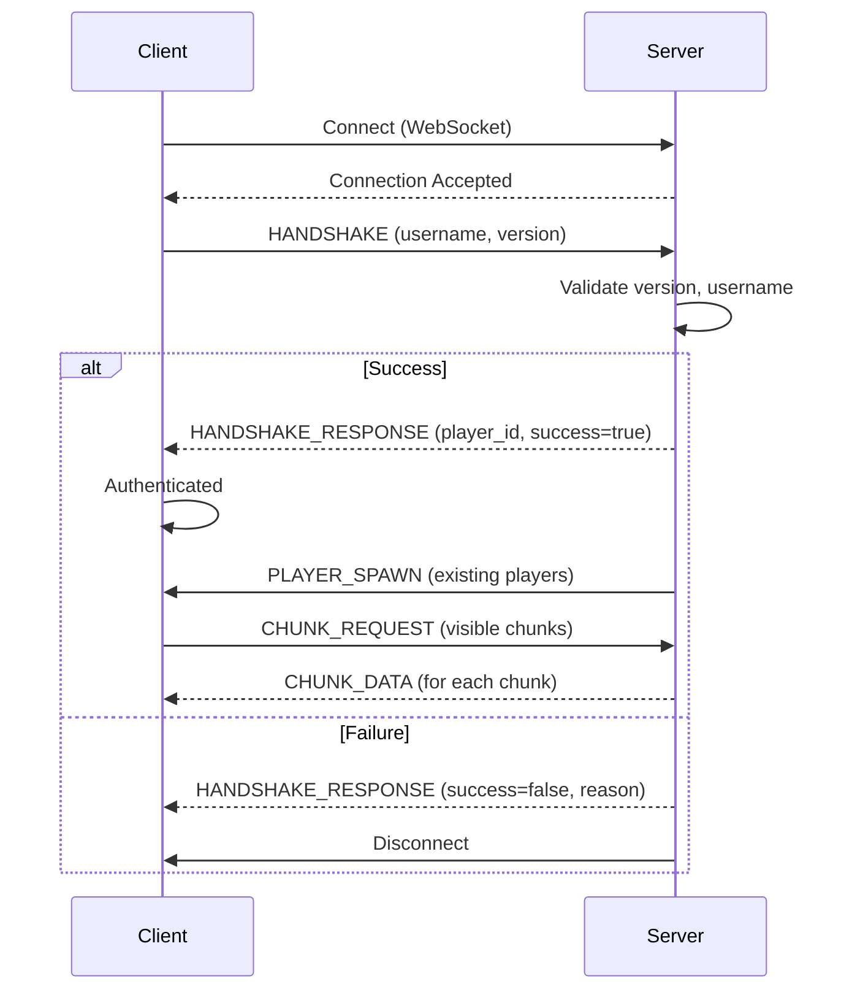

# Network API Documentation

Complete reference for Vitaverse network protocol.

## Protocol Overview

- **Transport**: WebSocket (ENet via Godot multiplayer API)
- **Format**: JSON messages
- **Architecture**: Client-server (server authoritative)
- **Protocol Version**: 1.0.0

## Connection Flow



## Packet Types

### Connection (0-9)

#### HANDSHAKE (0)
**Direction**: Client → Server
**Description**: Initial connection handshake

```json
{
  "type": 0,
  "username": "PlayerName",
  "game_version": "0.1.0",
  "protocol_version": "1.0.0",
  "timestamp": 1234567890
}
```

#### HANDSHAKE_RESPONSE (1)
**Direction**: Server → Client
**Description**: Server response to handshake

```json
{
  "type": 1,
  "player_id": 42,
  "success": true,
  "message": "Welcome to Vitaverse!",
  "timestamp": 1234567890
}
```

#### DISCONNECT (2)
**Direction**: Both
**Description**: Graceful disconnect

```json
{
  "type": 2,
  "reason": "Player quit",
  "timestamp": 1234567890
}
```

### Player State (10-29)

#### PLAYER_MOVE (10)
**Direction**: Client → Server
**Description**: Player movement input

```json
{
  "type": 10,
  "pos": [128.5, 256.0],
  "vel": [100.0, 0.0],
  "timestamp": 1234567890
}
```

**Rate Limit**: 60 per second

#### PLAYER_STATE (11)
**Direction**: Server → Client
**Description**: Other player's state

```json
{
  "type": 11,
  "player_id": 42,
  "pos": [128.5, 256.0],
  "vel": [100.0, 0.0],
  "timestamp": 1234567890
}
```

#### PLAYER_SPAWN (12)
**Direction**: Server → Client
**Description**: New player joined

```json
{
  "type": 12,
  "player_id": 42,
  "username": "NewPlayer",
  "pos": [0.0, 0.0],
  "timestamp": 1234567890
}
```

#### PLAYER_DESPAWN (13)
**Direction**: Server → Client
**Description**: Player left the game

```json
{
  "type": 13,
  "player_id": 42,
  "timestamp": 1234567890
}
```

### World Data (30-49)

#### CHUNK_DATA (30)
**Direction**: Server → Client
**Description**: Full chunk data

```json
{
  "type": 30,
  "chunk_x": 5,
  "chunk_y": 10,
  "tiles": [1, 1, 1, ...],  // 1024 tile IDs
  "timestamp": 1234567890
}
```

**Size**: ~4KB per chunk (uncompressed)

#### CHUNK_REQUEST (31)
**Direction**: Client → Server
**Description**: Request chunk data

```json
{
  "type": 31,
  "chunk_x": 5,
  "chunk_y": 10,
  "timestamp": 1234567890
}
```

**Rate Limit**: 100 per second

#### TILE_UPDATE (32)
**Direction**: Server → Client
**Description**: Single tile changed

```json
{
  "type": 32,
  "chunk_x": 5,
  "chunk_y": 10,
  "local_x": 15,
  "local_y": 20,
  "tile_id": 101,  // Road
  "timestamp": 1234567890
}
```

**Rate Limit**: None (server-initiated)

#### TILE_BATCH_UPDATE (33)
**Direction**: Server → Client
**Description**: Multiple tiles changed at once

```json
{
  "type": 33,
  "updates": [
    {"chunk_x": 5, "chunk_y": 10, "local_x": 15, "local_y": 20, "tile_id": 101},
    {"chunk_x": 5, "chunk_y": 10, "local_x": 16, "local_y": 20, "tile_id": 101}
  ],
  "timestamp": 1234567890
}
```

### Actions (50-69)

#### BUILD_TILE (51)
**Direction**: Client → Server
**Description**: Place a tile

```json
{
  "type": 51,
  "world_x": 512.0,
  "world_y": 768.0,
  "tile_id": 101,
  "timestamp": 1234567890
}
```

**Rate Limit**: 10 per second

**Server Validation**:
- Is tile type valid?
- Is location accessible?
- Does player have required items? (future)

#### DESTROY_TILE (52)
**Direction**: Client → Server
**Description**: Remove a tile

```json
{
  "type": 52,
  "world_x": 512.0,
  "world_y": 768.0,
  "timestamp": 1234567890
}
```

**Rate Limit**: 10 per second

**Server Validation**:
- Is tile destructible?
- Does player have permission?

### Chat & Social (70-89)

#### CHAT_MESSAGE (70)
**Direction**: Client → Server
**Description**: Send chat message

```json
{
  "type": 70,
  "message": "Hello world!",
  "timestamp": 1234567890
}
```

**Rate Limit**: 5 per second
**Max Length**: 256 characters

#### CHAT_BROADCAST (71)
**Direction**: Server → Client
**Description**: Chat message from a player

```json
{
  "type": 71,
  "player_id": 42,
  "username": "PlayerName",
  "message": "Hello world!",
  "timestamp": 1234567890
}
```

### System (90-99)

#### PING (90)
**Direction**: Both
**Description**: Latency measurement

```json
{
  "type": 90,
  "timestamp": 1234567890
}
```

#### PONG (91)
**Direction**: Both
**Description**: Ping response

```json
{
  "type": 91,
  "original_timestamp": 1234567890,
  "timestamp": 1234567895
}
```

**Latency Calculation**: `current_time - original_timestamp`

#### ERROR (99)
**Direction**: Server → Client
**Description**: Error message

```json
{
  "type": 99,
  "error_code": 8,
  "error_message": "Protocol version mismatch - please update your client",
  "timestamp": 1234567890
}
```

## Error Codes

| Code | Name | Description |
|------|------|-------------|
| 0 | NONE | No error |
| 1 | INVALID_VERSION | Game version not supported |
| 2 | SERVER_FULL | Max players reached |
| 3 | INVALID_CREDENTIALS | Bad username/password |
| 4 | TIMEOUT | Connection timeout |
| 5 | ALREADY_CONNECTED | Already connected |
| 6 | BANNED | Player is banned |
| 7 | KICKED | Player was kicked |
| 8 | PROTOCOL_MISMATCH | Protocol version mismatch |
| 99 | UNKNOWN | Unknown error |

## Rate Limiting

Server enforces rate limits to prevent abuse:

| Packet Type | Limit | Window |
|-------------|-------|--------|
| PLAYER_MOVE | 60/sec | Rolling |
| CHUNK_REQUEST | 100/sec | Rolling |
| BUILD_TILE | 10/sec | Rolling |
| DESTROY_TILE | 10/sec | Rolling |
| CHAT_MESSAGE | 5/sec | Rolling |

Exceeding limits results in dropped packets (no error sent).

## Best Practices

### Client Implementation

1. **Always include timestamp** in outgoing packets
2. **Handle disconnections gracefully** - show user-friendly message
3. **Cache chunk data** - don't re-request same chunks
4. **Throttle movement updates** - only send when changed
5. **Validate user input** before sending to server

### Server Implementation

1. **Validate all inputs** - never trust client data
2. **Rate limit aggressively** - prevent spam/DOS
3. **Use authoritative state** - server decides truth
4. **Log suspicious activity** - detect cheating
5. **Broadcast efficiently** - batch updates when possible

## Security

### Client-Server Trust Model

- **Server is authoritative** for all game state
- **Clients cannot be trusted** - always validate
- **Never expose secrets** in client code
- **Rate limiting** prevents denial-of-service

### Anti-Cheat Measures

- Position validation (teleport detection)
- Speed checks (movement hacks)
- Action validation (impossible actions)
- Rate limiting (spam prevention)
- Server-side physics (no client prediction exploits)

## Versioning

Protocol version follows semantic versioning:
- **Major**: Breaking changes (incompatible)
- **Minor**: New features (backward compatible)
- **Patch**: Bug fixes (backward compatible)

Current: **1.0.0**

Clients must match server protocol version exactly.

## Future Enhancements

- [ ] Binary protocol (more efficient than JSON)
- [ ] Packet compression (reduce bandwidth)
- [ ] Delta compression for chunk updates
- [ ] Voice chat packets
- [ ] Screen sharing protocol
- [ ] P2P for nearby players (reduce server load)

## Testing

Use `wscat` to test raw WebSocket communication:

```bash
npm install -g wscat
wscat -c ws://localhost:9000

# Send handshake
{"type":0,"username":"Test","game_version":"0.1.0","protocol_version":"1.0.0","timestamp":123}
```

---

**Last Updated**: 2025-11-15
**Protocol Version**: 1.0.0
