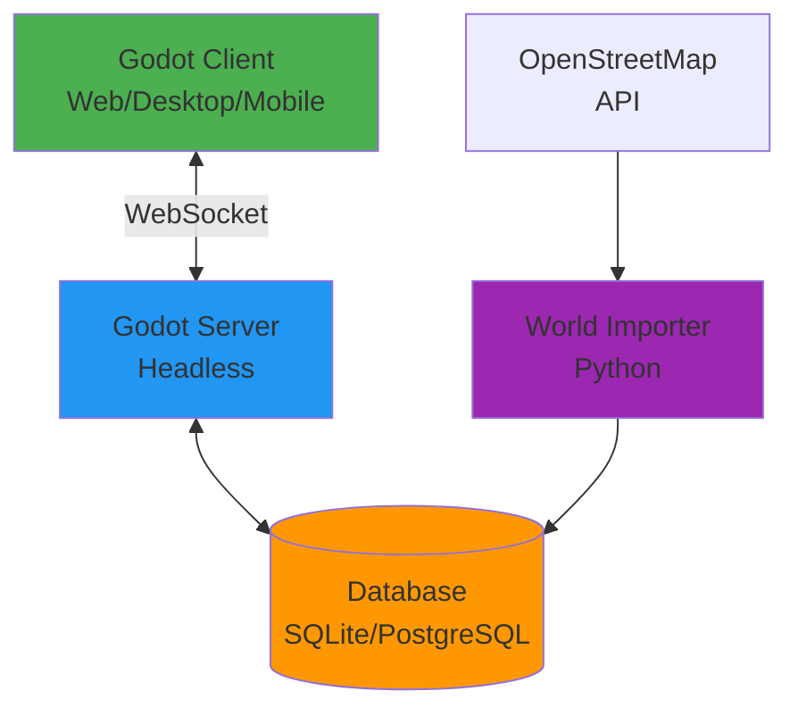
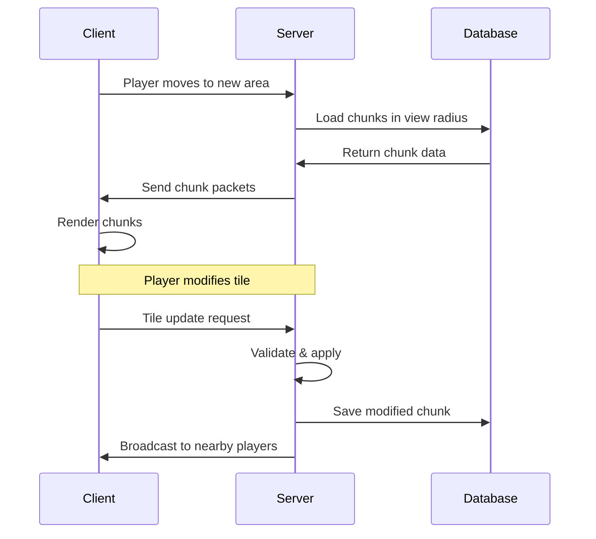

# Architecture Overview

## System Design



## Core Systems

### 1. Chunk System

The world is divided into chunks for efficient streaming and simulation.

**Specifications:**
- Chunk size: 32×32 tiles
- Dynamic loading/unloading based on player proximity
- Server-authoritative architecture
- Client renders only loaded chunks

**Chunk Coordinates:**
```
World Position (1024, 512) → Chunk (32, 16)
Chunk (32, 16) → World Position Range: (1024-1055, 512-543)
```

**Data Flow:**


### 2. Networking Architecture

**Client-Server Model:**
- Server is authoritative for all game state
- Clients send inputs, receive state updates
- Server validates all actions (anti-cheat)

**Protocol:**
- Transport: WebSocket (cross-platform compatibility)
- Message format: JSON (human-readable, debuggable)
- Future: Can migrate to binary protocol for performance

**Packet Types:**
```gdscript
enum PacketType {
    # Client → Server
    PLAYER_MOVE,        # Movement input
    PLAYER_ACTION,      # Build, destroy, interact
    CHAT_MESSAGE,       # Chat text

    # Server → Client
    CHUNK_DATA,         # Full chunk data
    TILE_UPDATE,        # Single tile change
    PLAYER_STATE,       # Other players' states
    WORLD_STATE,        # Environmental updates
}
```

### 3. World Persistence

**Storage Strategy:**

| Phase | Technology | Scale | Use Case |
|-------|-----------|-------|----------|
| Development | File-based JSON | < 1000 chunks | Local testing |
| Alpha | SQLite | < 100k chunks | Single server |
| Beta | PostgreSQL | < 10M chunks | Distributed servers |
| Production | PostgreSQL + Redis | Unlimited | High availability |

**Chunk Storage Format:**
```json
{
  "chunk_x": 32,
  "chunk_y": 16,
  "version": "1.0.0",
  "tiles": [1,1,1,2,2,3,...],
  "metadata": {
    "created_at": "2025-11-15T10:30:00Z",
    "modified_at": "2025-11-15T12:45:00Z",
    "owner": null,
    "name": "Downtown Seattle"
  }
}
```

**Database Schema (PostgreSQL):**
```sql
CREATE TABLE chunks (
    x INTEGER NOT NULL,
    y INTEGER NOT NULL,
    tile_data BYTEA NOT NULL,
    metadata JSONB,
    created_at TIMESTAMP DEFAULT NOW(),
    modified_at TIMESTAMP DEFAULT NOW(),
    PRIMARY KEY (x, y)
);

CREATE INDEX idx_chunks_modified ON chunks(modified_at);
CREATE INDEX idx_chunks_metadata ON chunks USING gin(metadata);

CREATE TABLE players (
    id UUID PRIMARY KEY,
    username VARCHAR(255) UNIQUE NOT NULL,
    auth_provider VARCHAR(50) DEFAULT 'simple',
    position_x REAL,
    position_y REAL,
    inventory JSONB,
    created_at TIMESTAMP DEFAULT NOW(),
    last_login TIMESTAMP
);
```

### 4. World Simulation

**Simulation Tiers** (Performance Optimization):

| Distance from Players | Update Rate | Simulation Detail |
|----------------------|-------------|-------------------|
| 0-100m (Active) | 60 FPS | Full pathfinding, animations, physics |
| 100-500m (Near) | 10 FPS | Simplified AI, basic updates |
| 500m-2km (Far) | 1 FPS | Statistical simulation |
| 2km+ (Dormant) | Event-based | Time-compressed formulas |

**Example - Plant Growth:**
```gdscript
# Active area (full simulation)
func _process_plant_active(plant, delta):
    plant.water -= EVAPORATION_RATE * delta
    if plant.water > GROWTH_THRESHOLD:
        plant.size += GROWTH_RATE * delta

# Dormant area (formula-based)
func _process_plant_dormant(plant, time_elapsed):
    # Calculate final state after time_elapsed seconds
    plant.size = calculate_growth_formula(
        plant.initial_size,
        plant.water,
        time_elapsed
    )
```

## Package Architecture

### `packages/godot-game/`

Main game implementation in Godot 4.

**Structure:**
```
godot-game/
├── client/      # Client-only code (rendering, input, UI)
├── server/      # Server-only code (game logic, validation)
└── shared/      # Shared code (data structures, constants)
```

**Separation Benefits:**
- Client build excludes server code (smaller bundle)
- Server build excludes assets (faster deployment)
- Clear boundaries prevent client-side cheating

### `packages/world-importer/`

Python tools for importing real-world data.

**Workflow:**
```
OpenStreetMap → Fetch → Parse → Convert → Save
                                           ↓
                                    Game Database
```

**Example:**
```python
from world_importer import OSMFetcher, TileConverter

# Fetch Seattle downtown
data = OSMFetcher().fetch_area(47.6062, -122.3321, radius_km=2)

# Convert to game tiles
chunks = TileConverter().osm_to_chunks(data)

# Save to database
for chunk in chunks:
    chunk.save()
```

### `packages/infrastructure/`

Deployment and DevOps configuration.

**Components:**
- Docker containers (server, database)
- Database migrations
- Monitoring setup (Prometheus/Grafana)
- CI/CD workflows

## Design Principles

### 1. Modularity
Clear package boundaries with well-defined interfaces.

### 2. Scalability
- Horizontal scaling: Multiple server instances
- Vertical scaling: Efficient chunk streaming
- Database sharding by region (future)

### 3. Versioning
- Protocol version in every packet
- Database schema migrations
- Backward compatibility for clients

### 4. Observability
- Structured logging (JSON format)
- Metrics collection (Prometheus)
- Error tracking (Sentry, future)

### 5. Testability
- Unit tests for core systems
- Integration tests for networking
- Load testing for scalability

## Security Considerations

### Client-Server Trust Model
- **Never trust the client**
- Server validates all actions
- Rate limiting on inputs
- Sanity checks on positions/values

### Authentication
- Phase 1: Simple username (development)
- Phase 2: OAuth (Google, Discord)
- Phase 3: Multi-factor authentication

### Data Protection
- No sensitive data in client code
- Environment variables for secrets
- Encrypted connections (WSS)

## Performance Targets

### Client Performance
- 60 FPS on modern hardware
- 30 FPS minimum on web browsers
- < 100ms input latency
- < 50MB memory for web build

### Server Performance
- 100+ concurrent players per instance
- < 16ms tick time (60 TPS)
- < 500ms chunk load time
- < 1GB RAM per 10k chunks loaded

## Future Architecture Evolution

### Phase 1: Single Server (Now)
```
[Clients] → [Single Server + SQLite]
```

### Phase 2: Dedicated Database
```
[Clients] → [Server] → [PostgreSQL]
```

### Phase 3: Horizontal Scaling
```
[Clients] → [Load Balancer] → [Server Fleet] → [PostgreSQL + Redis]
```

### Phase 4: Regional Distribution
```
[Clients]
    ↓
[Edge Servers by Region]
    ↓
[Central Database Cluster]
```

## Technology Choices - Rationale

| Choice | Reason |
|--------|--------|
| **Godot 4** | Cross-platform, open-source, excellent 2D, small builds |
| **WebSocket** | Universal support, works in browsers, easy debugging |
| **SQLite → PostgreSQL** | Start simple, scale when needed |
| **JSON (now) → Binary (future)** | Human-readable development, optimize later |
| **Top-down 2D** | Simpler than isometric, better performance, easier assets |
| **32×32 chunks** | Industry standard, good balance of granularity |

## References

- [Godot Networking Docs](https://docs.godotengine.org/en/stable/tutorials/networking/index.html)
- [OpenStreetMap API](https://wiki.openstreetmap.org/wiki/API)
- [PostgreSQL JSON Support](https://www.postgresql.org/docs/current/datatype-json.html)

---

**Last Updated:** 2025-11-15
